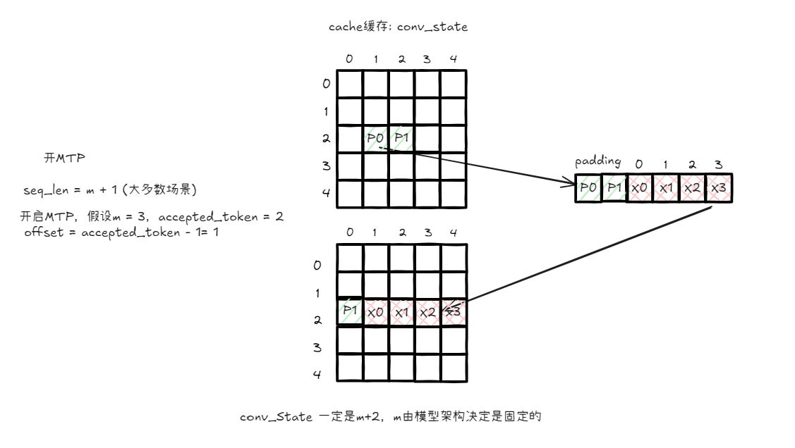
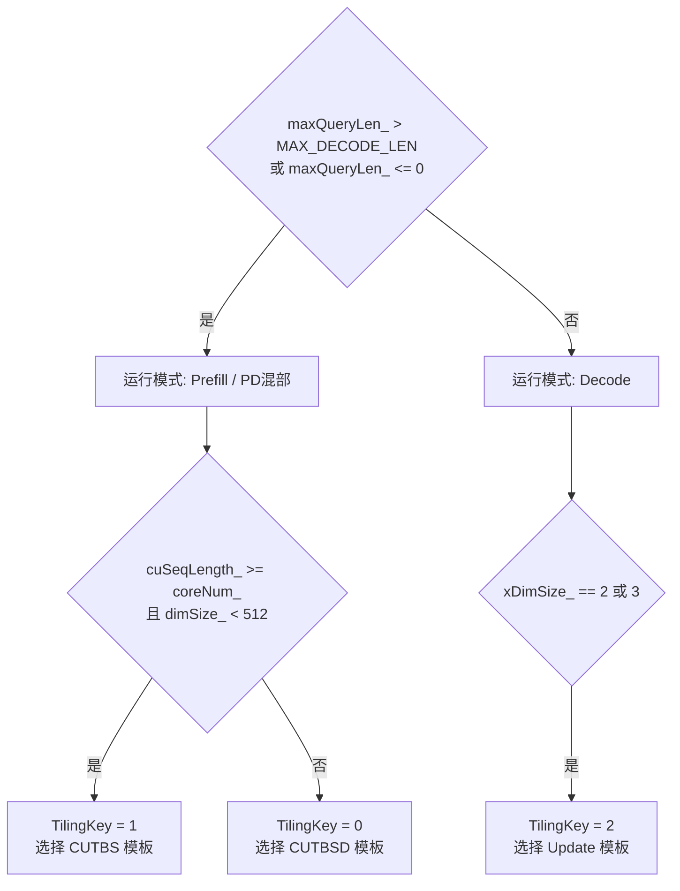

# fused_causal_conv1d算子新增投机tokens数参数需求分析与设计说明书

<center><strong>修订记录</strong></center>

<div align="center">

| 日期 | 修订版本 | 修改描述 | 作者 |
| :---: | :---: | :---: | :---: |
| 2026-07-27 | 1.0 | 设计初稿 | 金小龙/j00443785 |

</div>

## 1. 需求描述

> **章节说明**：本章节为算子概要设计，撰写责任人：需求方（模型算法/训练/推理），算子SE协助澄清。
> 例1：如果该需求是算法需求，如mhc，算法负责填写算子功能、原理、数学公式和golden脚本等通用性内容；训练或推理负责填写网络典型shape、期待性能目标等业务系统强相关内容。
> 例2：如果该需求是业务系统需求，本章节撰写责任人为具体需求方。如训练mhc_pre_grad算子融合add操作是一个融合算子需求，需求方为训练系统。

### 1.1 需求背景

#### 1.1.1 网络模型

> **章节说明**：明确业务模型，如Deepseek系列，Pangu系列，Qwen系列等具体模型。例如，Pangu V2 92B。

Pangu V2 92B、505B

#### 1.1.2 应用场景

> **章节说明**：明确此需求为训练需求、推理需求、训练&推理需求。例如，推理，极低时延Decode场景

推理场景，Dflash投机采样。

当前算子支持投机个数（multiTokenNum，即MTP draft token数）最大为7，本次需求将其扩展到16，以支持更大的投机窗口，提升投机解码的吞吐收益。

#### 1.1.3 业务目标

> **章节说明**：明确业务目标，如：30BA3模型训练MFU提升到20%；推理Pangu V2 92B极低时延TPOT达到4ms等


1、fuse_causal_conv1d算子支持投机个数（multiTokenNum）从 7 增加到 16，对应 conv_states 的 stateLen 从最大 9 扩展到最大 18，MAX_DECODE_LEN 从 8 扩展到 17。




### 1.2 需求规格
> **章节说明**：明确提供实现该需求的基线，如功能原理、数学公式、小算子拼接脚本、**整网Profiling**等

#### 1.2.1 算子功能

##### 1.2.1.1 功能和原理

> **章节说明**：明确该算子的原理、在整网上下文的位置和范围
>
> HCCL算子补充介绍算子的使用场景（网络拓扑、数据量）、配置文件（rootinfo文件、topo文件、RankTable文件字段说明）、环境变量等相关上下文信息。

算子整体功能与原本保持不变。

算子对序列执行因果一维卷积，支持 APC（Automatic Prefix Caching）、MTP（投机解码）、残差连接、原地更新等特性。

**核心参数关系**：

- `m`（multiTokenNum）：投机 draft token 个数，当前范围 [0, 7]，需扩展到 [0, 16]
- `stateLen = K - 1 + m = 2 + m`：K = 3时，conv_states 第二维大小，当前最大 9，需扩展到最大 18
- `seqLen = m + 1`：3D 输入 `[batch, seqLen, dim]` 时 x 的第二维
- `MAX_DECODE_LEN = m + 1`：区分 prefill/decode 模式的阈值，当前 8，需扩展到 17

**投机解码模式**下，算子通过 `numAcceptedTokens` 输入确定每个 batch 实际接受的投机 token 数，据此计算 offset 并从 conv_states 中读取对应的缓存状态，拼接输入后执行因果卷积。

##### 1.2.1.2 数学公式

> **章节说明**：明确数学公式（需包含输入、输出、数据类型、layout、维度）

- **数学公式**

本次需求不涉及数学公式变更

- **参数信息**

不涉及


##### 1.2.1.3 Golden实现

> **章节说明**：提供**可独立执行的算子Gloden真值脚本**（超出50行的代码采用附件形式）：
>
> HCCL算子不涉及

继承已有的golden代码，m∈[0,7] 扩展到m∈[0,16] 

#### 1.2.2 客户需求

> **章节说明**：算子调用通路，如单算子，图模式包括aclgraph和GE（是否支持superkernel）。默认支持两条通路，如仅支持一条通路，说明原因；
> A2/A3推理算子默认支持Aclgraph入图（需明确后端，如**eager/npugraph-ex**等）；
> A5推理算子默认Aclgraph和GE入图。

| 序号 | 需求标题  | 硬件平台   | 调用通路   | 性能需求  | 精度需求  | 是否支持非连续tensor   |
| ---- | ----- | ------------ | ---------- | ----- | ----------- | ----------- |
| 1    | fused_causal_conv1d新增投机tokens数参数且数目≤16 | A2/A3推理 | 继承已有的调用通路 | 否 | 精度2.1 的L1等级 | 是（继承现有支持） |

#### 1.2.3 需求规格分析

> **章节说明**：包含场景分析，基于场景分析导出算子的客户网络shape和泛化规格
> **撰写责任人：需求方（模型算法/训练/推理），算子SE协助澄清。**

##### 1.2.3.1 场景分析

> **章节说明**：分析算子应用的场景，确保算子覆盖典型的网络场景，接口前后向兼容
>
> - 明确需要支持哪些模型，比如pangu 92B、505B
>   - 明确需要支持的模型，以及算子涉及的配置参数，例如swiglu算子对应的moe_intermediate_size，cross entropy算子对应的vocab_size等
> - 明确该算子在 **推理、训练、RL（训推一致性）** 三种场景下的需求差异。
>   - 给出是否涉及的结论，涉及的部分说明影响，例如推理和训练前向接口兼容性，训推一致性。
> - 明确 TP / DP / EP/ CP等并行策略对算子输入输出 Shape、接口、精度的影响。
>   - 给出是否涉及的结论，涉及的部分说明具体的影响，例如支持的TP数，shape与TP数的关系
> - 明确泛化规格，说明泛化范围的依据，特别是shape。
> - 是否涉及接口前后向兼容

- **模型**：Pangu V2 92B、505B，Dflash投机采样场景。
- **推理/训练/RL**：仅涉及推理场景。算子接口（输入输出tensor、属性参数）无变化，仅扩大 m 的合法范围，算子功能不受影响。
- **并行策略**：TP 切分影响 dim 维度（dim/TP），与 m 无关；DP/EP/CP 不影响算子接口。本次修改不引入新的并行策略影响。
- **泛化规格依据**：Pangu模型的需求
- **接口前后向兼容**：完全兼容。m∈[0,7] 的原有调用行为不变，仅放宽了校验上限。接口签名、参数类型、返回值均无变化。

##### 1.2.3.2 客户网络规格

> **章节说明**：本次需求涉及的网络及其对应的**网络shape**、每一个shape需要对应涉及的场景（训练、推理、RL）、涉及的TP/DP/EP数、影响设计的典型shape与参数需要给出，如layout/mode等。下面列出FA算子作为示例。
> 其中，HCCL算子不涉及，因为HCCL把输入数据作为字节块进行搬运。


| 参数                                  | 整网实际值          | 维度/Shape          | 备注                                                    |
| :------------------------------------ | :------------------ | :------------------ | :------------------------------------------------------ |
| **`x`**                               | `(49, 1024)`        | `[49, 1024]`        | 合法                                                    |
| **`weight`**                          | `(3, 1024)`         | `[3, 1024]`         | 合法                                                    |
| **`conv_states`**                     | `(15168, 17, 1024)` | `[15168, 17, 1024]` | `state_len=17 => m=15`，投机长度变大                    |
| **`query_start_loc`**                 | `(2,)`              | `[2]`               | 合法，`[0, 49]`                                         |
| **`cache_indices`**                   | `(1,)`              | **一维 `[1]`**      | -                                                       |
| **`num_accepted_tokens`**             | `(1,)`              | `[1]`               | -                                                       |
| **`num_computed_tokens`**             | `(1,)`              | `[1]`               | -                                                       |
| **`block_idx_first_scheduled_token`** | `None`              | -                   | AP关闭时允许为`None`                                    |
| **`block_idx_last_scheduled_token`**  | `None`              | -                   | AP关闭时允许为`None`                                    |
| **`initial_state_idx`**               | `None`              | -                   | AP关闭时允许为`None`                                    |
| **`block_size`**                      | `4096`              | -                   | 值变大，但合法（>=2）                                   |
| **`max_query_len`**                   | `16`                | -                   | ⚠️ **与x实际长度可能不匹配**                             |
| 其他参数                              | -                   | -                   | `conv_mode=1`, `residual_connection=1`, `inplace=False` |


##### 1.2.3.3 泛化规格

> **章节说明**：在客户网络shape基础上进行泛化，并给出依据（**依据来源于场景分析章节**）
> **撰写责任人：算子SE**

| 维度 | 泛化规格 | 依据 |
| ---- | -------- | ---- |
| m (multiTokenNum) | [0, 16] | 从 [0,7] 扩展，支持 Dflash 更大投机窗口 |
| stateLen | [2, 18] | stateLen = K-1+m |
| MAX_DECODE_LEN | 16 | 区分 prefill/decode 阈值，= m+1 的最大值 |
| B | [1, 1024] | 继承现有规格 |
| D | [64, 16384]（16对齐） | 继承现有规格 |
| 数据类型 | BF16 / FP16 | 继承现有规格 |

> #### 1.2.4 HCCL算子约束分析
> |维度| 规格|约束原因|
> | -------- | ------------ | -- |
> |支持的芯片类型|A2、A3、A5||
> |支持的通信引擎|CCU MS/SCHED、AIV、AICPU、HOST||
> |支持的通信域大小|Server内、PoD内、超节点内、跨超节点||
> |支持的拓扑形态|Mesh/Ring、对称/非对称||
> |支持的调用模式|单算子、GE、AclGraph||
> |支持的数据类型|int16,int32,fp16,fp32,bf16, ...||
> |支持的数据量|无限制/数据量范围||
> |通信算法是否支持绕路|支持/不支持||
> |其他约束项|||

不涉及

## 2. 算子设计

> **章节说明**：本章节为概要设计，撰写责任人：算子SE。

### 2.1 算法原理

> **章节说明**：算子的算法原理和数学公式。
>
> HCCL算子不涉及数学公式。HCCL的算法原理指各个rank之间交互流程。

算子算法原理不变，详见1.2.1.1节。本次修改仅为参数范围扩展，不涉及算法逻辑变更。

**关键约束链**：`m → stateLen = k - 1 + m → UB buffer 大小 → ubFactor`

### 2.2 竞品分析

> **章节说明**：如无竞品，则不涉及。

#### 2.2.1 接口分析

> **章节说明**：如该算子有相关竞品接口定义（包括torch/triton/CUDA等），需分析接口与特性上的差异。

实现分析：如该算子有针对竞品硬件的性能相关特性，需要分析说明。

#### 2.2.2 实现分析

> **章节说明**：如该算子有针对竞品硬件的性能相关特性，需要分析说明。

#### 2.2.3 竞分总结

|          | Torch with CUDA | **Torch_npu** |
| -------- | --------------- | ------------- |
| 特性差异 |                 |               |
| 数据类型 |                 |               |
| 实现差异 | SIMT实现        | SIMD实现      |
| ......   |                 |               |


### 2.3 计算流程图

> **章节说明**：算子的计算流程图及流程描述。
>
> HCCL算子详细画出各个rank之间交互时序图，包括各个rank的处理逻辑、消息收发和同步等关键步骤。

不涉及计算流程修改

### 2.4 接口设计

> **章节说明**：按需填写，如接口实现不涉及改动，需给出原接口定义链接；

#### 2.4.1 PyTorch接口定义

> **章节说明**：参照torch_npu接口文档，需包含接口定义与参数描述。如算子设计章节已给出，此处引用即可。（新特性引入的接口变化部分需说明关联特性）

**函数原型**

```python
torch_npu.npu_ai_infra_fused_causal_conv1d(
    x: torch.Tensor,
    weight: torch.Tensor,
    conv_states: torch.Tensor,
    *,
    query_start_loc: Optional[torch.Tensor] = None,
    cache_indices: Optional[torch.Tensor] = None,
    initial_state_mode: Optional[torch.Tensor] = None,
    bias: Optional[torch.Tensor] = None,
    num_accepted_tokens: Optional[torch.Tensor] = None,
    num_computed_tokens: Optional[torch.Tensor] = None,
    block_idx_first_scheduled_token: Optional[torch.Tensor] = None,
    block_idx_last_scheduled_token: Optional[torch.Tensor] = None,
    initial_state_idx: Optional[torch.Tensor] = None,
    activation: Optional[str] = None,
    pad_slot_id: Optional[int] = -1,
    run_mode: Optional[int] = 0,
    max_query_len: Optional[int] = -1,
    residual_connection: Optional[int] = 1,
    block_size: Optional[int] = 128,
    conv_mode: Optional[int] = 1,
    inplace: Optional[bool] = False,
    maxDraftTokens: Optional[int] = 7
) -> torch.Tensor
```

**参数说明**：

| 参数名                                  | 输入/输出 | 描述                                                         | 使用说明                                                     | 数据类型          | 数据格式 | 维度(shape)                                                  | 非连续Tensor |
| :-------------------------------------- | :-------- | :----------------------------------------------------------- | :----------------------------------------------------------- | :---------------- | :------- | :----------------------------------------------------------- | :----------- |
| x                                       | 输入/输出 | 公式中的输入序列x，当inplace为true时，卷积结果将原地更新至x，无效batch部分保持x原数值不变。 | 不支持空Tensor；支持 token 维度不连续。                      | BFLOAT16、FLOAT16 | ND       | 2维[cuSeqLen, dim] 或3维[batch, seqLen, dim]。cuSeqLen ∈ [1, 1024K]。dim ∈ [64, 16384]，dim % 16 == 0。 | √            |
| weight                                  | 输入      | 公式中的因果1维卷积核w。                                     | 不支持空Tensor。                                             | 同 x              | ND       | 2维[K, dim]，K ∈ [3, 6]。                                    | √            |
| conv_states                             | 输入/输出 | 缓存状态张量，存储各序列的历史token数据，计算完成后原地更新。 | 不支持空Tensor；支持 token 维度不连续。                      | 同 x              | ND       | 3维[..., stateLen, dim]，第0维大小不固定。stateLen >= K-1。MTP模式：stateLen >= K-1+m，**m ∈ [0, 16]**（本次扩展）。 | √            |
| query_start_loc                         | 可选输入  | 序列起始位置索引。                                           | 支持空Tensor。x 为2维时不可省略。                            | INT32             | ND       | 1维 [batch+1,]，batch ∈ [1, 4K]。                            | √            |
| cache_indices                           | 可选输入  | 缓存索引。                                                   | 不支持空Tensor，APC开启时必须为2维。值需互不相同（除非等于padSlotId）。 | INT32             | ND       | 1维 [batch,] 或 2维[batch, maxNumBlocks]。                   | √            |
| initial_state_mode                      | 可选输入  | 初始状态标志。                                               | 不支持此字段。                                               | INT32             | ND       | 1维 [batch,]                                                 | √            |
| bias                                    | 可选输入  | 卷积偏置。                                                   | 不支持此字段。                                               | 同 x              | ND       | 1维 [dim,]                                                   | √            |
| num_accepted_tokens                     | 可选输入  | 投机token个数。                                              | 支持空指针。**值域 [0, 16]**（本次扩展：从[0,7]扩展至[0,16]）。0=prefill，>=1=decode。 | INT32             | ND       | 1维 [batch,]                                                 | √            |
| num_computed_tokens                     | 可选输入  | 已处理token总数。                                            | 支持空指针。首token时使用零初始化缓存；Pangu V2模式下不能为空。 | INT32             | ND       | 1维 [batch,]                                                 | √            |
| block_idx_first_scheduled_token         | 可选输入  | 第一个token对应的block索引。                                 | 支持空指针。APC开启时不能为空。                              | INT32             | ND       | 1维 [batch,]                                                 | √            |
| block_idx_last_scheduled_token          | 可选输入  | 最后一个token对应的block索引。                               | 支持空指针。APC开启时不能为空。                              | INT32             | ND       | 1维 [batch,]                                                 | √            |
| initial_state_idx                       | 可选输入  | 初始索引块的索引。                                           | 支持空指针。APC开启时不能为空。                              | INT32             | ND       | 1维 [batch,]                                                 | √            |
| activation                              | 可选输入  | 激活函数类型。                                               | 支持None、"silu"。默认None。                                 | STR               | -        | -                                                            | -            |
| pad_slot_id                             | 可选输入  | 跳过不需要参与计算的变长序列。                               | 仅支持不参与计算的变长序列在x的开头或结尾。                  | INT64             | -        | 默认值 -1                                                    | -            |
| run_mode                                | 可选输入  | prefill或decode场景。                                        | 0:prefill，1:decode。默认0。                                 | INT64             | -        | 默认值0                                                      | -            |
| max_query_len                           | 可选输入  | 所有batch中的最大seq_len。                                   | 支持为-1。                                                   | INT64             | -        | 默认值1                                                      | -            |
| residual_connection                     | 可选输入  | 残差连接开关。                                               | 0:不残差，1:残差。默认1。                                    | INT64             | -        | 默认值1                                                      | -            |
| block_size                              | 可选输入  | block块大小。                                                | 典型值128/256。                                              | INT64             | -        | 默认值128                                                    | -            |
| conv_mode                               | 可选输入  | 卷积模式。                                                   | 0:Qwen3-Next社区版本，1:Pangu V2。默认1。                    | INT64             | -        | 默认值1                                                      | -            |
| inplace                                 | 可选输入  | 是否原地更新。                                               | False:非原地更新，True:原地更新。默认False。                 | BOOL              | -        | 默认值 False                                                 | -            |
| <font color="red">maxDraftTokens</font> | 可选输入  | 最大投机token个数                                            | 范围[0, 16]                                                  | INT64             | -        | 默认值  7                                                    | -            |

**返回值说明**

| 参数名 | 输入/输出 | 描述                                   | 数据类型 | 数据格式 | 维度(shape)   | 非连续Tensor |
| ------ | --------- | -------------------------------------- | -------- | -------- | ------------- | ------------ |
| y      | 输出      | 卷积计算结果（含残差连接和SiLU激活后） | 同 x     | ND       | 与 x 保持一致 | -            |


#### 2.4.2 aclnn接口定义

> **章节说明**：参照aclnn接口文档，需包含两段式接口定义与参数描述。如算子设计章节已给出，此处引用即可。（新特性引入的接口变化部分需说明关联特性）
> 
> HCCL算子不涉及aclnn接口。
>
> 注意：使用说明必须明确是否支持空tensor
> 


```c++
aclnnStatus aclnnAiInfraFusedCausalConv1dGetWorkspaceSize(
  aclTensor  *x,
  const aclTensor *weight,
  aclTensor *convStates,
  const aclTensor *queryStartLoc,
  const aclTensor *cacheIndices,
  const aclTensor *initialStateMode,
  const aclTensor *bias,
  int64_t  maxQueryLen,
  int64_t  padSlotId,
  int64_t  runMode,
  const aclTensor *numComputedTokens,
  const aclTensor *numAcceptedTokens,
  const aclTensor *blockIdxFirstScheduledToken,
  const aclTensor *blockIdxLastScheduledToken,
  const aclTensor *initialStateIdx,
  int64_t maxDraftTokens,
  int64_t  blockSize,
  int64_t  convMode,
  bool inplace,
  int64_t residualConnection,
  int64_t activationMode,
  aclTensor *y,
  uint64_t *workspaceSize,
  aclOpExecutor **executor)
```

```c++
aclnnStatus aclnnAiInfraFusedCausalConv1d(
  void *workspace,
  uint64_t workspaceSize,
  aclOpExecutor *executor,
  aclrtStream stream)
```


**参数说明**：

| 参数名                                  | 输入/输出 | 描述               | 使用说明                                                     | 数据类型          | 数据格式 | 维度(shape)                                    | 非连续Tensor |
| --------------------------------------- | --------- | ------------------ | ------------------------------------------------------------ | ----------------- | -------- | ---------------------------------------------- | ------------ |
| x                                       | 输入      | 输入序列           | 不支持空指针；支持token维度不连续；dim需满足dim % 16 == 0    | FLOAT16、BFLOAT16 | ND       | 2维[cu_seq_len, dim]或3维[batch, seq_len, dim] | √            |
| weight                                  | 输入      | 因果一维卷积核     | 不支持空指针；K ∈ [3, 6]                                     | 同x               | ND       | 2维[K, dim]                                    | √            |
| convStates                              | 输入/输出 | 缓存状态张量       | 不支持空指针；原地更新；**MTP模式state_len >= K-1+m，m ∈ [0, 16]** | 同x               | ND       | 3维[..., state_len, dim]                       | √            |
| queryStartLoc                           | 可选输入  | 序列起始位置索引   | 支持空指针；x为2维时不可省略                                 | INT32             | ND       | 1维[batch+1,]                                  | √            |
| cacheIndices                            | 可选输入  | 缓存索引           | 支持空指针；APC开启时为2维                                   | INT32             | ND       | 1维或2维                                       | √            |
| initialStateMode                        | 可选输入  | 初始状态标志       | 支持空指针                                                   | INT32             | ND       | 1维[batch,]                                    | √            |
| bias                                    | 可选输入  | 卷积偏置           | 支持空指针                                                   | 同x               | ND       | 1维[dim,]                                      | √            |
| maxQueryLen                             | 输入      | 最大seq_len        | -                                                            | INT64             | -        | -                                              | -            |
| padSlotId                               | 输入      | 跳过无效batch      | 建议值-1                                                     | INT64             | -        | -                                              | -            |
| runMode                                 | 输入      | 运行模式           | 0:prefill，1:decode                                          | INT64             | -        | -                                              | -            |
| numComputedTokens                       | 可选输入  | 已处理token总数    | 支持空指针；Pangu V2模式下不能为空                           | INT32             | ND       | 1维[batch,]                                    | √            |
| numAcceptedTokens                       | 可选输入  | **投机token个数**  | 支持空指针；**值域[0, 16]**（本次扩展）；0=prefill，>=1=decode | INT32             | ND       | 1维[batch,]                                    | √            |
| blockIdxFirstScheduledToken             | 可选输入  | 首token的block索引 | 支持空指针；APC开启时不能为空                                | INT32             | ND       | 1维[batch,]                                    | √            |
| blockIdxLastScheduledToken              | 可选输入  | 尾token的block索引 | 支持空指针；APC开启时不能为空                                | INT32             | ND       | 1维[batch,]                                    | √            |
| initialStateIdx                         | 可选输入  | 初始索引块索引     | 支持空指针；APC开启时不能为空                                | INT32             | ND       | 1维[batch,]                                    | √            |
| <font color="red">maxDraftTokens</font> | 可选输入  | 最大投机token个数  | 范围[0, 16]，默认7                                           | INT64             | -        | -                                              | -            |
| blockSize                               | 输入      | block大小          | APC开启时不能为0，典型值128/256                              | INT64             | -        | -                                              | -            |
| convMode                                | 输入      | 卷积模式           | 0:Qwen3-Next，1:Pangu V2                                     | INT64             | -        | -                                              | -            |
| inplace                                 | 输入      | 是否原地更新       | FALSE/TRUE                                                   | BOOL              | -        | -                                              | -            |
| residualConnection                      | 输入      | 残差连接           | 0:关闭，1:开启                                               | INT64             | -        | -                                              | -            |
| activationMode                          | 输入      | 激活函数           | 0:None，1:silu                                               | INT64             | -        | -                                              | -            |
| y                                       | 输出      | 输出序列           | 不支持空指针；shape与x一致                                   | 同x               | ND       | 与x一致                                        | -            |


#### 2.4.3 C++接口定义

> **章节说明**：此章节仅涉及HCCL算子，其他算子不涉及。参照HCCL接口文档，需包含接口定义与参数描述。如算子设计章节已给出，此处引用即可。（新特性引入的接口变化部分需说明关联特性）

不涉及

#### 2.4.4 算子原型定义

> **章节说明**：对于GE入图，需明确算子原型定义，否则为不涉及。新特性引入的接口变化部分需说明关联特性。

不涉及


### 2.5 程序架构设计

> **章节说明**：是否涉及类似FA的common层的处理，如不涉及，写"不涉及"。
>
> HCCL算子是否需要同时修改HCCL算子包和HCOMM基础包，如不涉及，写"不涉及"或者写只修改HCCL算子包/HCOMM基础包。

不涉及架构变更。修改集中在 op_host（tiling 常量和校验）和文档/测试，kernel 侧无需修改（buffer 大小由 tiling data 动态驱动）。

### 2.6 Tiling策略

> **章节说明**：算子Tiling、Buffer策略，如不涉及，写"不涉及"。
>
> HCCL算子不涉及Tiling策略。

不涉及tiling策略修改。




但是m的增加，会影响模板内的UB分配。

1）CUTBSD: buffer不依赖m值(statLen)，逐token计算，因此性能不受影响

2）CUTBS： cacheQue / cacheBuf 与 **m(stateLen)** 成正比，长度会增加，单次UB加载的token数量会减少，循环次数会增加（ 循环次数 +18% ），性能会劣化

3）UPDATE：convStateQueueSpace 与 **m(stateLen)** 成正比，长度会增加，maxDim会减少，单次UB加载dim 长度会减少 （maxDim -25.5%），循环次数会增加，性能会劣化


策略：

1、新增1个可选的maxDraftTokens字段，默认值7，根据maxDraftTokens值分配UB中的buffer大小。


**文档改动点：**

- Tiling 常量修改

**文件**：`op_host/ai_infra_fused_causal_conv1d_tiling.h`

| 常量             | 修改前 | 修改后 | 位置   | 说明                                     |
| ---------------- | ------ | ------ | ------ | ---------------------------------------- |
| `MAX_M`          | 7      | 16     | 第84行 | 投机个数上限                             |
| `MAX_DECODE_LEN` | 8      | 17     | 第80行 | prefill/decode 模式判定阈值，= MAX_M + 1 |

- Tiling 校验逻辑变更

- UB Buffer 策略影响分析

1）**CUTBS 路径**（prefill 场景 dim < 512）：

`stateLen` = k-1+m 增大，直接影响以下 UB buffer 计算：(以K = 3为例)

| Buffer          | 修改前 (stateLen=9) | 修改后 (stateLen=17) | 增量       |
| --------------- | ------------------- | -------------------- | ---------- |
| cacheQue (BF16) | 18 KB               | 34 KB                | +16 KB     |
| cacheBuf (BF16) | 9 KB                | 17 KB                | +8 KB      |
| **合计增量**    | -                   | -                    | **+24 KB** |

增量约 24KB，导致 `spaceWithUbfactor` 减小，`ubFactor_` 下降（预计从约 28 降至约 24），每次 UB 迭代处理的 token 数减少。

2）**CUTBSD 路径**（prefill 场景 dim >= 512）：buffer 分配不依赖 `stateLen`，**不受影响**。

3）**Update 路径**（decode 场景）：

Update 路径的 tiling 逻辑通过 `spaceWithDim`（每个 dim 元素占用的 UB 字节数）动态计算 `maxDim`，确保 UB 不溢出。因此 Update 路径 UB 不会溢出，但 m 增大会导致`maxDim`下降，进而可能增加 dim 维度的核切分数量、降低 batch 并行度。


#### 2.6.4 Kernel 侧 Buffer 分析

Kernel 的 buffer 分配全部基于 tiling data 中的 `stateLen`、`multiTokenNum` 等参数动态计算，**无硬编码与 m 相关的 buffer 大小**。关键分配点：

| Kernel | Buffer           | 大小公式                               | 说明            |
| ------ | ---------------- | -------------------------------------- | --------------- |
| Update | convStatesQueue_ | stateLen × curDim × sizeof(DTYPE)      | 动态，随 m 增大 |
| CUTBS  | cacheQue         | 2 × stateLen × baseDim × sizeof(DTYPE) | 动态，随 m 增大 |
| CUTBS  | cacheBuf         | stateLen × baseDim × sizeof(DTYPE)     | 动态，随 m 增大 |
| CUTBSD | convStatesQue    | 2 × baseDim × sizeof(DTYPE)            | 不依赖 stateLen |

Kernel 计算逻辑（卷积滑动窗口、cache 读写、offset 计算）均基于 tiling 参数动态运行，无需修改。

### 2.7 性能设计

> **章节说明**：
> 明确客户场景典型输入、输出和约束，完成算子**kernel性能设计**，如不涉及，写"不涉及"。
> 明确是否涉及硬件亲和设计，如不涉及，写"不涉及"。

### 2.8 一致性设计

> **章节说明**：本需求是否需要支持：1）确定性计算；2）Batch一致性；3）训推一致性。

#### 2.8.1 确定性计算设计
> 默认采用确定性计算，如果“否”，即非确定性计算，需要说明原因

不影响原有的确定性计算。


#### 2.8.2 Batch一致性设计
> **章节说明**：新增训练前向和推理算子默认支持batch一致性选项。新增特性默认不改变算子的batch一致性。如果新增算子或新增特性导致算子本身不支持batch一致性，请明确原因。
不影响原有的batch一致性计算。

#### 2.8.3 训推一致性设计
> **章节说明**：本需求是否需要支持训推一致性。如需，填写针对训推一致性的方案设计。

不影响原有的训推一致性。

### 2.9 验收标准

> **章节说明**：
> 定义功能、性能和精度的测试方法和验收标准。
> 明确验收标杆：真值、同精度标杆

功能：

fuse_causal_conv1d算子支持投机个数（multiTokenNum）从 7 增加到 16。

精度： 

继承原有的精度2.1标准 L1等级标准。

性能：

1）m = 7 或m不输入时，单算子性能耗时无劣化。

### 2.10 兼容性设计

> **章节说明**：
> 包含以下内容：
> 考虑算子是否兼容A2、A3、A5等。其中基于A2或A3设计的算子默认同时支持A2和A3，如仅支持单一硬件平台，此处写明原因；
> HCCL算子的外部依赖涉及的模块、组件，例如HCCP。
> 本需求算子对其它算子可能产生的影响。

1、接口新增可选入参，参数默认值与原本保持不变，兼容原本的算子性能

### 2.11 异常场景设计
> 列举异常场景以及处理方法，抛异常、返回错误码、DFX日志等；

不涉及

### 2.12 关联需求

> **章节说明**：
> 附上该需求关联需求管理平台的需求信息

| **需求编号** | 需求标题                                         | 需求链接                                                     |
| ------------ | ------------------------------------------------ | ------------------------------------------------------------ |
|              | fused_causal_conv1d新增投机tokens数参数且数目≤16 | https://e.gitee.com/omniai/projects/809894/requirements/table?issue=IK4XEX |
|              |                                                  |                                                              |

