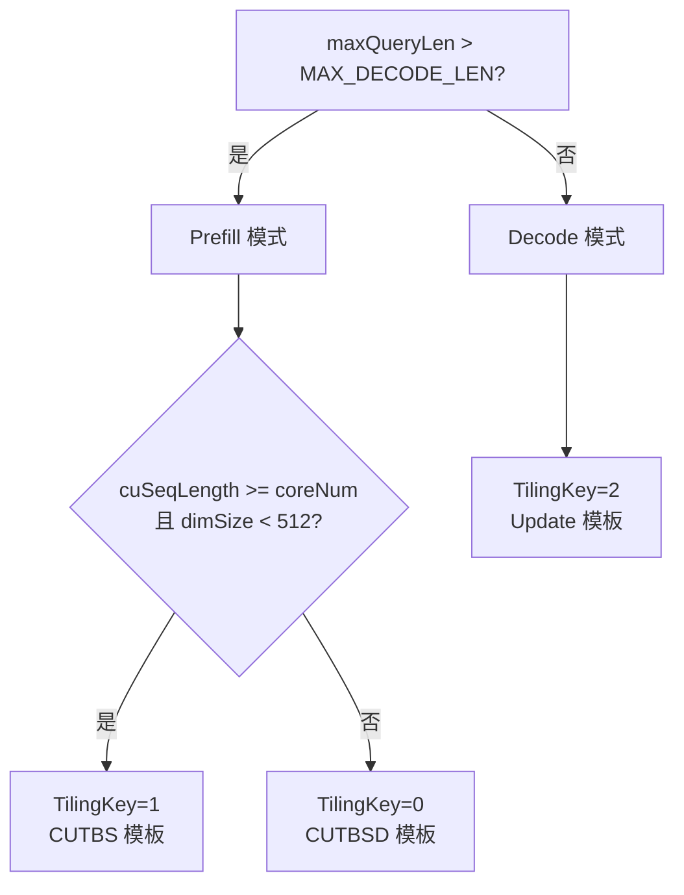

# fused_causal_conv1d 算子功能实现详解

## 一、算子概述

### 1.1 算子定位

**fused_causal_conv1d** 是为大模型推理场景（尤其是 Pangu V2 92B/505B）设计的融合算子，用于 **投机解码（Speculative Decoding / MTP - Multi-Token Prediction）** 和 **自动前缀缓存（APC - Automatic Prefix Caching）** 场景。

**核心功能**：对输入序列执行**因果一维卷积**（Causal 1D Convolution），同时支持：
- 历史状态缓存与更新（conv_states）
- 投机采样的 draft token 处理
- 残差连接
- SiLU 激活
- 原地更新（inplace）

**应用位置**：在 Transformer 架构中，通常位于 SSM（State Space Model）或 Mamba 类模型的卷积层，用于捕获序列的局部依赖关系。

---

## 二、投机解码（MTP）工作原理

### 2.1 什么是投机解码？

在大模型推理中，传统 decode 每次只生成 1 个 token：
```
prompt → [token1] → [token2] → [token3] → ...
```

**投机解码**通过一个轻量级的 draft model 一次预测多个候选 token（如 7 个），再由主模型验证：
```
draft model: 预测 [t1, t2, t3, t4, t5, t6, t7]
main model:  验证并接受前 m 个 (如 m=3)
实际接受: [t1, t2, t3] ✓，丢弃 [t4, t5, t6, t7] ✗
```

- **`m`（multiTokenNum）**：实际被主模型接受的 draft token 数量，范围 **[0, 7]**（本次需求扩展到 **[0, 16]**）
- **`seqLen = m + 1`**：输入序列长度（m 个 draft token + 1 个当前 token）
- **`stateLen = K - 1 + m`**：缓存状态长度（K=3 时，当前最大 9，需扩展到最大 18）

### 2.2 算子在投机解码中的作用

1. **输入**：包含当前 token + m 个 draft tokens 的序列 `[batch, m+1, dim]`
2. **读取缓存**：根据 `num_accepted_tokens[batch]` 确定每个 batch 实际接受了多少个 draft token，从 `conv_states` 中读取对应的历史状态
3. **拼接卷积**：将历史状态与当前输入拼接，执行因果卷积
4. **更新缓存**：将新计算的状态写回 `conv_states`，为下一轮推理做准备

---

## 三、关键参数与约束

### 3.1 核心参数关系链

```
m (multiTokenNum)              投机 draft token 个数
     ↓
stateLen = K - 1 + m           conv_states 第二维大小 (K=3 时)
     ↓
UB buffer 大小 ∝ stateLen      影响 tiling 策略和性能
     ↓
MAX_DECODE_LEN = m + 1         区分 prefill/decode 的阈值
```

**当前值 vs 目标值**：

| 参数             | 当前值 | 目标值 | 说明                               |
|------------------|--------|--------|------------------------------------|
| `m`              | [0, 7] | [0, 16] | 投机个数上限                       |
| `stateLen`       | 最大 9 | 最大 18 | conv_states 第二维（K=3 时）       |
| `MAX_DECODE_LEN` | 8      | 17     | prefill/decode 模式判定阈值        |

### 3.2 接口参数详解

#### 必选输入

| 参数           | 维度                     | 说明                                   |
|----------------|--------------------------|----------------------------------------|
| **x**          | `[cu_seq_len, dim]` 或 `[batch, seqLen, dim]` | 输入序列，dim 必须 16 对齐             |
| **weight**     | `[K, dim]`               | 卷积核，K ∈ [3, 6]                     |
| **conv_states**| `[batch_capacity, stateLen, dim]` | 缓存状态，原地更新                     |

#### 可选输入（投机解码相关）

| 参数                     | 维度        | 作用                                       |
|--------------------------|-------------|--------------------------------------------|
| **num_accepted_tokens**  | `[batch]`   | 每个 batch 实际接受的 draft token 数，值域 **[0, 16]**（本次扩展） |
| **num_computed_tokens**  | `[batch]`   | 已处理的 token 总数，用于判断是否首次计算 |

#### 属性参数

| 参数                    | 类型   | 说明                                       |
|-------------------------|--------|--------------------------------------------|
| **maxDraftTokens**      | int64  | **新增参数**，最大投机 token 数，范围 [0, 16]，默认 7 |
| **max_query_len**       | int64  | 所有 batch 中的最大 seq_len                |
| **residual_connection** | int64  | 残差连接开关（0: 关闭，1: 开启）           |
| **activation_mode**     | int64  | 激活函数（0: None，1: silu）               |
| **conv_mode**           | int64  | 卷积模式（0: Qwen3-Next，1: Pangu V2）     |
| **inplace**             | bool   | 是否原地更新 x                             |

---

## 四、算子执行流程

### 4.1 模式判定

```cpp
// 代码位置：op_host/ai_infra_fused_causal_conv1d_tiling.cpp:101
runMode_ = maxQueryLen_ > MAX_DECODE_LEN || maxQueryLen_ <= 0 ? 0 : 1;
// runMode_ = 0: prefill 模式（长序列）
// runMode_ = 1: decode 模式（短序列，投机解码）
```

### 4.2 Tiling 策略选择

根据运行模式和数据特征，选择 3 种 kernel 模板之一：



**三种模板的特点**：

| 模板          | 适用场景                     | m 影响                                   |
|---------------|------------------------------|------------------------------------------|
| **CUTBSD**    | Prefill，dim ≥ 512           | buffer 不依赖 stateLen，**不受 m 影响**  |
| **CUTBS**     | Prefill，dim < 512           | cacheQue/cacheBuf ∝ stateLen，**受 m 影响** |
| **Update**    | Decode（投机解码）           | convStatesQueue ∝ stateLen，**受 m 影响** |

### 4.3 核心计算流程

以 **decode 模式（投机解码）** 为例：

#### Step 1: 确定 offset

```cpp
// 代码位置：op_kernel/ai_infra_fused_causal_conv1d_update.h
if (numComputedTokens == 0) {
    offset = 0;  // 首次计算，缓存为零
} else if (hasNumAcceptedTokens) {
    offset = numAcceptedTokens[batchId] - 1;  // 投机模式：根据接受的 token 数
} else {
    offset = stateLen - (K - 1);  // 默认模式
}
```

#### Step 2: 读取缓存

```cpp
// 从 conv_states 读取历史状态
for (int i = 0; i < offset + K - 1; i++) {
    cachedState[i] = convStates[readCacheLine][i];
}
```

#### Step 3: 拼接输入

```cpp
// 拼接：[cachedState | currentInput]
paddedInput = [cachedState[0:offset+K-1], x[0:seqLen]]
// 总长度 = offset + K - 1 + seqLen
```

#### Step 4: 因果卷积

```cpp
// 对 paddedInput 执行 1D 卷积（K=3）
for (int i = 0; i < seqLen; i++) {
    y[i] = sum(paddedInput[i:i+K] * weight);
}
```

#### Step 5: 残差连接 + 激活

```cpp
if (residual_connection) {
    y = y + x;  // 残差连接
}
if (activation_mode == 1) {
    y = SiLU(y);  // y = y / (1 + exp(-y))
}
```

#### Step 6: 更新缓存

```cpp
// 将最新的 K-1+m 个状态写回 conv_states
int M = min(stateLen, offset + K - 1 + seqLen);
for (int i = 0; i < M; i++) {
    convStates[writeCacheLine][stateLen - M + i] = paddedInput[totalLen - M + i];
}
```

---

## 五、代码架构

### 5.1 目录结构（omni-ops 仓）

```
ai_infra_fused_causal_conv1d/
├── op_api/                                  # aclnn 接口层
│   ├── aclnn_ai_infra_fused_causal_conv1d.h  # L2 接口头文件
│   ├── aclnn_ai_infra_fused_causal_conv1d.cpp
│   └── ai_infra_fused_causal_conv1d.cpp      # L0 op executor
├── op_host/                                 # Tiling 层（host 端）
│   ├── ai_infra_fused_causal_conv1d_def.cpp  # OpDef 注册
│   ├── ai_infra_fused_causal_conv1d_tiling.h # Tiling 常量定义（包含 MAX_M、MAX_DECODE_LEN）
│   └── ai_infra_fused_causal_conv1d_tiling.cpp # Tiling 逻辑实现
├── op_kernel/                               # Kernel 层（device 端）
│   ├── ai_infra_fused_causal_conv1d.cpp      # Kernel 入口
│   ├── ai_infra_fused_causal_conv1d_common.h # 公共结构
│   ├── ai_infra_fused_causal_conv1d_fn_cutbs.h  # CUTBS 模板
│   ├── ai_infra_fused_causal_conv1d_fn_cutbsd.h # CUTBSD 模板
│   └── ai_infra_fused_causal_conv1d_update.h    # Update 模板（投机解码）
└── torch_ops_extension/.../csrc/
    └── npu_ai_infra_fused_causal_conv1d.cpp # PyTorch binding
```

### 5.2 调用链路

```
PyTorch API (torch_npu.npu_ai_infra_fused_causal_conv1d)
    ↓
PyTorch Binding (npu_ai_infra_fused_causal_conv1d.cpp)
    ↓
aclnn L2 接口 (aclnnAiInfraFusedCausalConv1dGetWorkspaceSize + aclnnAiInfraFusedCausalConv1d)
    ↓
L0 Executor (ai_infra_fused_causal_conv1d.cpp)
    ↓
Tiling 计算 (ai_infra_fused_causal_conv1d_tiling.cpp)
    ↓
Kernel 执行 (ai_infra_fused_causal_conv1d_update.h / fn_cutbs.h / fn_cutbsd.h)
```

---

## 六、本次需求要做什么

### 6.1 需求背景

当前算子支持的投机个数上限是 **7**（即 `m ∈ [0, 7]`），对应：
- `stateLen` 最大 9（K=3 时）
- `MAX_DECODE_LEN = 8`

**Pangu V2 模型的 Dflash 投机采样场景**需要更大的投机窗口，要求支持 **m ∈ [0, 16]**，以提升投机解码的吞吐收益。

### 6.2 改动范围

**本次改动不涉及算法逻辑变更**，仅扩展参数合法范围，具体涉及：

#### 1. **op_host 层（Tiling）**

**文件**：`op_host/ai_infra_fused_causal_conv1d_tiling.h`

| 常量             | 修改前 | 修改后 | 位置   |
|------------------|--------|--------|--------|
| `MAX_M`          | 7      | 16     | 第 85 行 |
| `MAX_DECODE_LEN` | 8      | 17     | 第 81 行 |

**影响**：
- `MAX_M` 扩大 → 校验逻辑放宽，允许更大的 `multiTokenNum`
- `MAX_DECODE_LEN` 扩大 → prefill/decode 判定阈值提升

#### 2. **接口层（可选参数 maxDraftTokens）**

**新增可选属性参数**：

| 参数名           | 类型  | 默认值 | 范围     | 作用                                   |
|------------------|-------|--------|----------|----------------------------------------|
| **maxDraftTokens** | int64 | 7      | [0, 16]  | 最大投机 token 数，用于 UB buffer 预算 |

**接口变更**：

- **aclnn 接口**：`aclnnAiInfraFusedCausalConv1dGetWorkspaceSize` 增加 `int64_t maxDraftTokens` 参数
- **PyTorch binding**：`torch_npu.npu_ai_infra_fused_causal_conv1d` 增加 `maxDraftTokens: Optional[int] = 7` 关键字参数
- **OpDef 注册**：`op_host/ai_infra_fused_causal_conv1d_def.cpp` 增加 `.Attr("max_draft_tokens").AttrType(OPTIONAL).Int()` 声明（**注意：需求文档未明确是否需要在 OpDef 声明，需与团队确认**）

#### 3. **Tiling 逻辑（UB 预算）**

**为什么需要 maxDraftTokens？**

UB（Unified Buffer）是 AI Core 的片上缓存，大小有限（~256KB）。`m` 扩大后，**CUTBS** 和 **Update** 模板的 buffer 需求增加：

| 模板      | Buffer                | 大小公式（K=3）                      | m=7 时 | m=16 时 | 增量  |
|-----------|-----------------------|--------------------------------------|--------|---------|-------|
| **CUTBS** | cacheQue              | 2 × stateLen × baseDim × sizeof(BF16) | 18 KB  | 34 KB   | +16 KB |
|           | cacheBuf              | stateLen × baseDim × sizeof(BF16)     | 9 KB   | 17 KB   | +8 KB  |
|           | **合计**              | -                                    | 27 KB  | 51 KB   | **+24 KB** |
| **Update**| convStatesQueue       | stateLen × curDim × sizeof(BF16)      | 动态   | 动态    | maxDim ↓ 25.5% |

**策略**：
- 新增 `maxDraftTokens` 参数，**根据用户指定的最大投机数预分配 UB buffer**
- **默认值 7**：向后兼容，不影响原有性能
- **设置为 16**：允许更大投机窗口，但单次 UB 迭代处理的 token 数减少，循环次数增加（CUTBS 路径 +18%，Update 路径 maxDim -25.5%）

#### 4. **Kernel 层（无需修改）**

**关键点**：Kernel 的 buffer 分配**全部基于 tiling data 动态计算**，无硬编码与 `m` 相关的大小。

示例（Update 模板）：
```cpp
// op_kernel/ai_infra_fused_causal_conv1d_update.h
int64_t stateLen = tilingData_->stateLen;  // 从 tiling data 获取
convStatesQueue_.SetGlobalBuffer((__gm__ DTYPE*)convStateGm.GetPhyAddr(), 
                                  stateLen * curDim);  // 动态分配
```

因此，**Kernel 层无需修改**，只要 tiling 层正确计算 `stateLen` 和相关参数即可。

#### 5. **文档与测试**

- **API 文档**：更新 PyTorch 接口文档，说明 `maxDraftTokens` 参数
- **Kernel 文档**：更新 `docs/` 下的算子说明，明确 m 的新范围
- **Golden 测试**：扩展 `tests/golden.py`，增加 m ∈ [8, 16] 的测试用例

### 6.3 不改动的部分

1. **算法逻辑**：卷积计算、缓存读写、offset 计算逻辑完全不变
2. **接口签名（除 maxDraftTokens）**：其他所有输入输出参数不变
3. **精度标准**：继承原有的精度 2.1 L1 等级标准
4. **性能基线**：`m ≤ 7` 或不传 `maxDraftTokens` 时，性能无劣化

### 6.4 兼容性设计

- **向后兼容**：`maxDraftTokens` 默认值 7，原有调用行为完全不变
- **接口兼容**：可选参数，不传则使用默认值
- **性能兼容**：仅当显式设置 `maxDraftTokens > 7` 时，才预留更大 UB buffer

---

## 七、使用示例

### 7.1 默认行为（向后兼容）

```python
import torch
import torch_npu

x = torch.randn(49, 1024, dtype=torch.bfloat16, device='npu')
weight = torch.randn(3, 1024, dtype=torch.bfloat16, device='npu')
conv_states = torch.randn(15168, 9, 1024, dtype=torch.bfloat16, device='npu')  # stateLen=9 (m=7)

# 不传 maxDraftTokens，使用默认值 7
y = torch_npu.npu_ai_infra_fused_causal_conv1d(
    x, weight, conv_states,
    max_query_len=1,
    residual_connection=1,
    block_size=4096,
    conv_mode=1
)
# 性能与原有版本一致
```

### 7.2 启用更大投机窗口

```python
# 支持 m=15 的投机解码
conv_states = torch.randn(15168, 17, 1024, dtype=torch.bfloat16, device='npu')  # stateLen=17 (m=15)
num_accepted_tokens = torch.randint(0, 16, (1,), dtype=torch.int32, device='npu')

y = torch_npu.npu_ai_infra_fused_causal_conv1d(
    x, weight, conv_states,
    num_accepted_tokens=num_accepted_tokens,
    max_query_len=16,
    residual_connection=1,
    block_size=4096,
    conv_mode=1,
    maxDraftTokens=16  # 显式指定最大投机数
)
# 允许 num_accepted_tokens ∈ [0, 16]
```

---

## 八、性能影响分析

### 8.1 CUTBS 路径（Prefill，dim < 512）

**影响**：
- `stateLen` 从 9 → 17，导致 `ubFactor_` 下降（预计从 ~28 降至 ~24）
- 每次 UB 迭代处理的 token 数减少
- **循环次数增加约 +18%**

**适用场景**：prefill 场景，一次性处理长序列，对延迟不敏感

### 8.2 CUTBSD 路径（Prefill，dim ≥ 512）

**影响**：**无影响**（buffer 分配不依赖 `stateLen`）

### 8.3 Update 路径（Decode，投机解码）

**影响**：
- `maxDim` 下降约 **-25.5%**
- dim 维度切分增加，可能降低 batch 并行度
- **延迟可能增加**，但吞吐收益来自于投机解码的接受率提升

**权衡**：
- 单次 kernel 延迟略增 → 但一次接受 16 个 token vs 7 个 token
- **总体端到端吞吐提升**（前提：draft model 准确率足够高）

---

## 九、验收标准

1. **功能**：`m ∈ [0, 16]` 的所有合法输入能正常执行
2. **精度**：继承原有精度 2.1 L1 等级标准
3. **性能**：
   - `m ≤ 7` 或不传 `maxDraftTokens` 时，性能无劣化
   - `m > 7` 时，性能劣化符合预期（UB 预算权衡）
4. **兼容性**：原有调用代码无需修改，行为不变

---

## 十、参考资料

- **设计文档**：`fused_causal_conv1d算子新增投机tokens数参数需求分析与设计说明书 - A3.md`
- **代码仓库**：
  - omni-ops: `D:\Desktop\Code\omni-ops\inference\ascendc\src\ops-transformer\attention\ai_infra_fused_causal_conv1d`
  - ops-transformer_AI (参考): `D:\Desktop\Code\ops-transformer_AI\attention\fused_causal_conv1d`
- **关键文件**：
  - Tiling 常量：`op_host/ai_infra_fused_causal_conv1d_tiling.h:81,85`
  - Tiling 逻辑：`op_host/ai_infra_fused_causal_conv1d_tiling.cpp:101,162,245`
  - Kernel 入口：`op_kernel/ai_infra_fused_causal_conv1d.cpp`
  - PyTorch binding：`torch_ops_extension/.../npu_ai_infra_fused_causal_conv1d.cpp`

---

**文档生成时间**：2026-08-03  
**目标芯片**：Ascend 910B (A2/A3)  
**适用场景**：Pangu V2 92B/505B 推理，Dflash 投机采样
